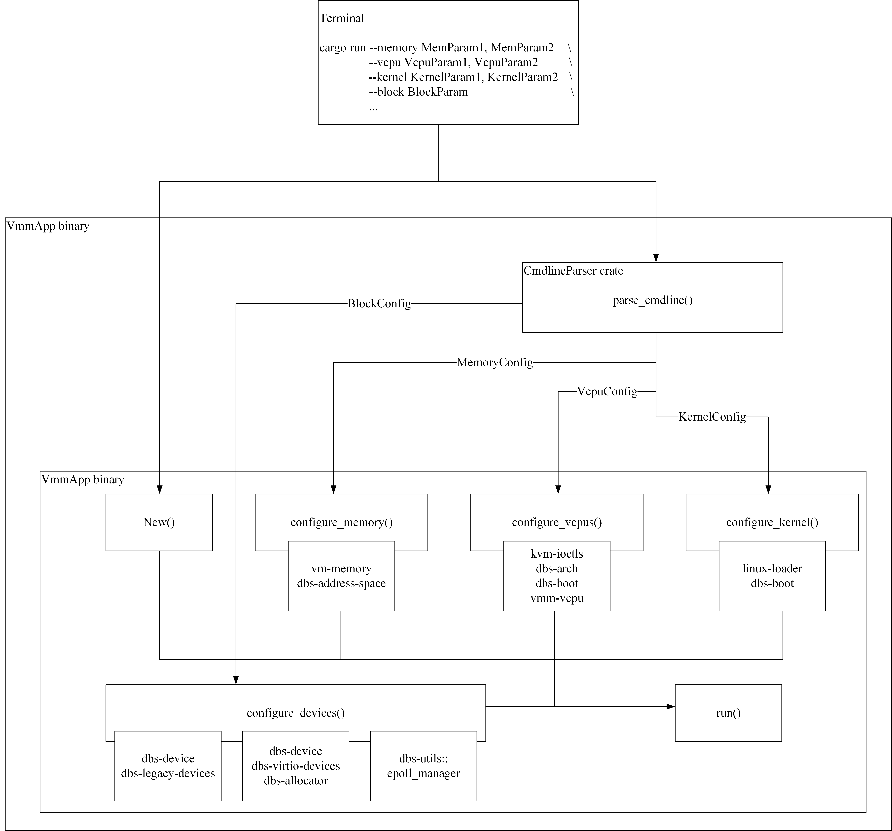

# Miniball

Miniball is a minimal virtual machine manager. Miniball is the subset of the Dragonball Sandbox using components from dragonball-sandbox and rust-vmm.
The purpose of the Miniball Project is to provide anyone who is interested in virtualization a good approach to learn it and also test the crates from dragonball-sandbox.

## Overview

### Design

Miniball consists of `rust-vmm` crates, `dragonball-sandbox` crates and minimal glue code that
sticks them together. The end result is a binary, roughly split between a
simple CLI and a `vmm` crate, which ingests all the available `rust-vmm` and `dragonball-sandbox`
building blocks compiled with all their available features. As crate
development progresses, in the future, we may have feature `X` in crate `A`
mutually incompatible with feature `Y` in crate `B` - therefore the Miniball,
which depends on both crates `A` and `B`, will no longer support features
`X` and `Y` simultaneously. If and when this situation occurs, multiple
binaries for the Miniball will be supplied.

The `vmm` crate allows for pluggable UIs via a `VMMConfig` structure. A
basic command line parser demonstrates how a frontend can be stitched to the
VMM.

Miniball will not provide any runtime configuration changes to the VM,
the full VM configuration has to be supplied when the VM is started. The simple
command line frontend is oneshot: all the configurations are specified at once,
and the VMM starts with them. To alter its structure, the VMM process must be
killed and re-run with the modified parameters. The core of the Miniball
is the `vmm` crate, which encapsulates and binds together all the other
functionality-providing crates; the user-facing component is minimalistic and
meant to be discarded when the VMM is forked for new usage, in order for the
user to provide an UI suitable to their needs.

The first iteration of the Miniball contains a subset of the crates
available in `rust-vmm`:
[`kvm-ioctls`](https://crates.io/crates/kvm-ioctls),
[`kvm-bindings`](https://crates.io/crates/kvm-bindings),
[`vm-memory`](https://crates.io/crates/vm-memory),
[`linux-loader`](https://crates.io/crates/linux-loader), 
and in `dragonball-sandbox`:
[`dbs-address-space`](https://crates.io/crates/dbs-address-space),
[`dbs-allocator`](https://crates.io/crates/dbs-allocator),
[`dbs-boot`](https://crates.io/crates/dbs-boot),
[`dbs-arch`](https://crates.io/crates/dbs-arch),
[`dbs-device`](https://crates.io/crates/dbs-device),
[`dbs-interrupt`](https://crates.io/crates/dbs-interrupt),
[`dbs-legacy-devices`](https://github.com/openanolis/dragonball-sandbox/tree/main/crates/dbs-legacy-devices),
[`dbs-utils`](https://crates.io/crates/dbs-utils) and 
[`dbs-virtio-devices`](https://github.com/openanolis/dragonball-sandbox/tree/main/crates/dbs-virtio-devices).

### Architecture

The Miniball is composed of 2 major crates packaged in a binary
application: the `vmm` and a oneshot CLI that invokes it. The `vmm` crate
exports an object (`struct Vmm`) that encapsulates all the
functionality-providing `rust-vmm` crates, as dependencies.

Users of the Miniball can replace the builtin command line parser with
frontends of their own, as long as they are passing a `VMMConfig` object to
the `vmm` crate (object that will store specialized `*Config` objects, e.g.
`struct MemoryConfig` for guest memory configurations, etc.). Alternatively,
users can disregard the `vmm` crate altogether and build their own, referring
to it only for guidelines.



## Steps to running a guest

Currently, the only available devices are the serial console, and a single
block device, that is used as the root filesystem. Therefore, the Miniball
can boot a simple Linux kernel either with a baked-in `initramfs` (no
block device configured) or with a separate rootfs.
`*Config` structs passed by the UI are cached in a `VmmConfig` struct until
`VMM::try_from()`, when the VMM is instantiated and the configurations are
turned into live objects.

The steps to running a guest, presuming the configurations are parsed and
stored, are as follows:

1. Set up KVM. This is done through `kvm-ioctls`. It creates the KVM virtual
   machine in the host kernel.

```rust
// src/vmm/src/vmm.rs

let kvm = Kvm::new().map_err(Error::KvmIoctl)?;

// Check that the KVM on the host is supported.
let kvm_api_ver = kvm.get_api_version();
if kvm_api_ver != KVM_API_VERSION as i32 {
    return Err(Error::KvmApiVersion(kvm_api_ver));
}
Vmm::check_kvm_capabilities(&kvm)?;
```

2. Configure guest memory. This is done through the [`vm-memory`](https://crates.io/crates/vm-memory) and 
   [`dbs-address-space`](https://crates.io/crates/dbs-address-space) crates. 
   The `vm-memory` creates and registers the guest memory with KVM.
   The `dbs-address-space` manage guest memory.
   See the [`Memory virtualization documentation`](https://github.com/openanolis/dragonball-sandbox/blob/main/crates/dbs-miniball/docs/MemoryVirtualization.md)
   for details on this part.
   1. Requirements: KVM set up
   2. Inputs
       1. guest memory size

```rust
// src/vmm/src/vmm.rs

let guest_memory = Vmm::create_guest_memory(&config.memory_config)?;
let address_space = Vmm::create_address_space(&config.memory_config)?;
let address_allocator = Vmm::create_address_allocator(&config.memory_config)?;
```

3. Create event manager for device events. 
   This is done through [`dbs-utils::epoll_manager`](https://github.com/openanolis/dragonball-sandbox/blob/main/crates/dbs-utils/src/epoll_manager.rs).

```rust
// src/vmm/src/vmm.rs

let event_manager = EpollManager::default();
event_manager.add_subscriber(Box::new(wrapped_exit_handler.0.clone()));
```

4. Configure the vCPUs. This is done through `vm-vcpu` crate, which is a
   local crate. This is done partially through [`kvm-ioctls`](https://crates.io/crates/kvm-ioctls), 
   [`dbs-arch`](https://crates.io/crates/dbs-arch) and 
   [`dbs-boot`](https://crates.io/crates/dbs-boot). 
   See the [`CPU virtualization documentation`](https://github.com/openanolis/dragonball-sandbox/blob/main/crates/dbs-miniball/docs/CPUVirtualization.md)
   for details on this part.
    
```rust
// src/vmm/src/vmm.rs

// Create the KvmVm.
let vm_config = VmConfig::new(&kvm, config.vcpu_config.num)?;
```

   1. Requirements: KVM is configured, guest memory is configured
   2. Inputs: vCPU registry values - hardcoded / embedded in VMM for the same
      reasons as boot parameters.
   3. Breakdown (`x86_64`):
       1. Configure MPTables. These
        [tables](https://pdos.csail.mit.edu/6.828/2014/readings/ia32/MPspec.pdf)
        tell the guest OS what the multiprocessor configuration looks like,
        and are required even with a single vCPU.

        ```rust
        // src/vm-vcpu/src/vm.rs
        
        #[cfg(target_arch = "x86_64")]        
        mptable::setup_mptable(guest_memory, vm.config.num_vcpus, vm.config.num_vcpus)
        .map_err(Error::MpTable)?;
        ```

       2. Create KVM `irqchip`. This creates the virtual IOAPIC and virtual
        PIC and sets up future vCPUs for local APIC.

        ```rust
        // src/vm-vcpu/src/vm.rs
      
        #[cfg(target_arch = "x86_64")]
        vm.setup_irq_controller()?;
        ```

       3. Create vCPUs. An `fd` is registered with KVM for each vCPU.
      
        ```rust
        // src/vm-vcpu/src/vm.rs
        
        vm.create_vcpus(bus, vcpus_config, guest_memory)?;
        ```

       4. Configure CPUID. Required (at least) because it’s the means by which
        the guest finds out it’s virtualized.
      
        ```rust
        // src/vm-vcpu/src/vcpu/mod.rs
        
        let base_cpuid = _kvm
        .get_supported_cpuid(kvm_bindings::KVM_MAX_CPUID_ENTRIES)
        .map_err(Error::KvmIoctl)?;
      
        dbs_arch::cpuid::process_cpuid(&mut cpuid, &vm_spec).map_err(|e| Error::CpuId(e))?;
        ```

       5. Configure MSRs (model specific registers). These registers control
        (among others) the processor features. See the
        [reference](https://www.intel.co.uk/content/dam/www/public/us/en/documents/manuals/64-ia-32-architectures-software-developer-system-programming-manual-325384.pdf#G14.8720).
      
        ```rust
        // src/vm-vcpu/src/vcpu/mod.rs
      
        #[cfg(target_arch = "x86_64")]
        dbs_arch::regs::setup_msrs(&self.vcpu_fd).map_err(Error::MSRSConfiguration)
        ```

       6. Configure other registers (`kvm_regs`, `kvm_sregs`, `fpu`) and the
        LAPICs.

        ```rust
        // src/vm-vcpu/src/vcpu/mod.rs
      
        #[cfg(target_arch = "x86_64")]
        {
            vcpu.configure_cpuid(&vcpu.config.cpuid)?;
            vcpu.configure_msrs()?;
            vcpu.configure_sregs(memory)?;
            vcpu.configure_lapic()?;
            vcpu.configure_fpu()?;
        }
        ```


5. legacy devices need to be configured with serial console and keyboard i8042 controller,
   serial console emulation is done through [`dbs-device`](https://crates.io/crates/dbs-device)
   and [`dbs-legacy-devices`](https://github.com/openanolis/dragonball-sandbox/tree/main/crates/dbs-legacy-devices) crates.
   Device event handling is mediated through
   [`dbs-utils::epoll_manager`](https://github.com/openanolis/dragonball-sandbox/blob/main/crates/dbs-utils/src/epoll_manager.rs).
   1. Requirements: KVM is configured, guest memory is configured, `irqchip`
      is configured (`x86_64`), event manager is configured
   2. Inputs: N/A
   3. Breakdown:
      1. Create dummy speaker. This needs to be emulated because some kernels
        access the speaker’s port, leading to continuous KVM exits for the
        otherwise unhandled device IO.
      2. Create serial console.

```rust
// src/vmm/src/lib.rs
        
vmm.add_serial_console()?;
#[cfg(target_arch = "x86_64")]
vmm.add_i8042_device()?;
```

6. Configure root block device. This is done through [`dbs-virtio-devices`](https://github.com/openanolis/dragonball-sandbox/tree/main/crates/dbs-virtio-devices). 
   Device event handling is mediated with [`dbs-utils::epoll_manager`](https://github.com/openanolis/dragonball-sandbox/blob/main/crates/dbs-utils/src/epoll_manager.rs).
   1. Requirements: KVM is configured, guest memory is configured, `irqchip`
      is configured (`x86_64`), event manager is configured

```rust
// src/vmm/src/lib.rs

if let Some(cfg) = config.block_config.as_ref() {
    vmm.add_block_device(cfg)?;
}
```

7. Load the guest kernel into guest memory. This is done through `linux-loader` and `dbs-boot` crates.
   See the [`Memory virtualization documentation`](https://github.com/openanolis/dragonball-sandbox/blob/main/crates/dbs-miniball/docs/MemoryVirtualization.md)
   for details on this part.
   1. Requirements: guest memory is configured
   2. Inputs:
      1. path to kernel file
      2. start of high memory (x86_64)
      3. kernel command line
      4. boot parameters - embedded in VMM
      5. Too complex to pass through the command line / other inputs:
         these are arch-dependent structs, built with `bindgen` and
         exported by `linux-loader`, that the user fills in outside
         `linux-loader` with arch- and use case-specific values.
      6. Some can be constants and can be externally specified, unless
         they make the UI unusable. Examples: kernel loader type, kernel
         boot flags, dedicated address for the kernel command line, etc.

```rust
// src/vmm/src/lib.rs

let load_result = self.load_kernel()?;
#[cfg(target_arch = "x86_64")]
let kernel_load_addr = self.compute_kernel_load_addr(&load_result)?;
```

## How To Use

### CLI reference

* `memory` - guest memory configurations
    * `size_mib` - `u32`, guest memory size in MiB (decimal)
        * default: 256 MiB
* `kernel` - guest kernel configurations
    * `path` - `String`, path to the guest kernel image
    * `cmdline` - `String`, kernel command line
        * default: "console=ttyS0 i8042.nokbd reboot=t panic=1 pci=off"
    * `kernel_load_addr` - `u64`, start address for high memory (decimal)
        * default: 0x100000
* `vcpus` - vCPU configurations
    * `num` - `u8`, number of vCPUs (decimal)
        * default: 1
* `block` - block device configuration
    * `path` - `String`, path to the root filesystem
* `net` - network device configuration
    * `tap` - `String`, tap name

*Note*: For now, only the path to the root block device can be configured
via command line. The block device will implicitly be read-write and with
`cache flush` command supported. Passing the `block` argument is optional,
if you want to skip it, make sure you pass to the `path` argument of the
`kernel` configuration, a suitable image (for example a Busybox one).
We plan on extending the API to be able to configure more block devices and
more parameters for those (not just the `path`).
We also want to offer the same support in the near future for network and
vsock devices.

#### Example: Override the kernel command line

```bash
dbs-miniball \
    --kernel path=/path/to/kernel/image,cmdline="reboot=t panic=1 pci=off"
```

#### Example: VM with 2 vCPUs and 1 GiB memory

```bash
dbs-miniball                           \
    --memory size_mib=1024          \
    --vcpu num=2                        \
    --kernel path=/path/to/kernel/image
```

### Getting Started

#### Prerequisites

##### OS & Hypervisor

Currently, the Miniball runs on Linux **x86_64** hosts, using the **KVM**
hypervisor. To make sure KVM is accessible to your user, run:

```bash
[ -r /dev/kvm ] && [ -w /dev/kvm ] && echo "OK" || echo "FAIL"
```

To grant your user access to KVM, either:

1. If you have the ACL package for your distro installed:

    ```bash
    sudo setfacl -m u:${USER}:rw /dev/kvm
    ```

   or

2. If your distribution uses the `kvm` group to manage access to `/dev/kvm`:

    ```bash
    [ $(stat -c "%G" /dev/kvm) = kvm ] && sudo usermod -aG kvm ${USER}
    ```

   Then log out and back in.

#### Build the Miniball

To build the Miniball from source, you need to have the Rust compiler and
`cargo` installed on your system. The following toolchains are supported:

- `x86_64-unknown-linux-gnu` (Linux with `glibc`, **default**)
- `x86_64-unknown-linux-musl` (Linux with `musl libc`)

As the Miniball does not yet have any compile-time features, building it
is as simple as:

```bash
cargo build [--release]
```

This will produce a binary called `dbs-miniball` in the `cargo` build
directory (default: `target/${toolchain}/${mode}`, where mode can be `debug` or
`release`).

#### Run the Miniball

##### Kernel

To build a kernel for the Miniball to boot, check out the scripts in
[resources/kernel](../resources/kernel).

- [`make_kernel_busybox_image.sh`](../resources/kernel/make_kernel_busybox_image.sh)
  builds an ELF or bzImage kernel with a baked-in initramfs running
  [Busybox](https://busybox.net/). It uses a stripped-down
  [kernel config](../resources/kernel/microvm-kernel-initramfs-hello-x86_64.config)
  and a statically linked [config](../resources/kernel/busybox_static_config)
  for the Busybox initramfs.

  Example:

  ```bash
  sudo ./make_kernel_busybox_image.sh -f elf -k vmlinux-hello-busybox -w /tmp/kernel
  ```

  produces a binary image called `vmlinux-hello-busybox` in the `/tmp/kernel`
  directory. Root privileges are needed to create device nodes.

  Run `./make_kernel_busybox_image.sh` with no arguments to see the help.

- [`make_kernel_image_deb.sh`](../resources/kernel/make_kernel_image_deb.sh)
  builds an ELF or bzImage kernel compatible with Ubuntu 20.04 from a
  stripped-down
  [kernel config](../resources/kernel/microvm-kernel-5.4-x86_64.config), as
  well as `.deb` packages containing the Linux kernel image and modules, to be
  installed in the guest. By default, the script downloads the `.deb` packages
  from an
  [official Ubuntu mirror](http://security.ubuntu.com/ubuntu/pool/main/l/linux-hwe-5.4),
  but it can build them from the same sources as the kernel instead. Users can
  opt in for this behavior by setting the `MAKEDEB` environment variable
  before running the script.

  Example:

  ```bash
  ./make_kernel_image_deb.sh -f bzimage -j 2 -k bzimage-focal -w /tmp/ubuntu-focal
  ```

  produces a binary image called `bzimage-focal` in the `/tmp/ubuntu-focal`
  directory. It downloads the `linux-modules` and `linux-image-unsigned`
  packages and places them inside the kernel source directory within
  `/tmp/ubuntu-focal` (the exact location is displayed at the end).

  Run `./make_kernel_image_deb.sh` with no arguments to see the help.

For more usage examples, see the
[Buildkite pipeline](../.buildkite/deps-pipeline.yml) that calls these scripts
as part of the CI.

##### Devices

The Miniball only supports a serial console device for now. This section
will be expanded as other devices are added. Block devices are in the works.

###### Block Device

To build a block device with a root filesystem in it containing an OS for the
Miniball, check out the scripts in [resources/disk](../resources/disk).

- [`make_rootfs.sh`](../resources/disk/make_rootfs.sh) builds a 1 GiB disk
  image containing an `ext4` filesystem with an Ubuntu 20.04 image.

  Example:

  ```bash
  sudo resources/disk/make_rootfs.sh -d /tmp/ubuntu-focal/deb -w /tmp/ubuntu-focal
  ```

  produces a file called `rootfs.ext4` inside `/tmp/ubuntu-focal` containing
  the Ubuntu 20.04 image and the kernel image installed from the `.deb`
  packages expected in `/tmp/ubuntu-focal/deb`. At the very least, the OS needs
  the `linux-image` and `linux-modules` packages. These can either be
  downloaded or built from sources. See [this section][#kernel] for examples on
  how to acquire these packages using scripts from this repo.

  Root privileges are needed to manage mountpoints.

#### Putting It All Together

Once all the prerequisites are met, the Miniball can be run either
directly through `cargo`, passing on its specific
[command line arguments](../README.md#cli-reference), or after building it with
`cargo build`.

```wrap
cargo run --release --            \
    --memory size_mib=1024        \
    --kernel path=${KERNEL_PATH}  \
    --vcpu num=1
```

```wrap
cargo build --release
target/release/dbs-miniball      \
    --memory size_mib=1024        \
    --kernel path=${KERNEL_PATH}  \
    --vcpu num=1
```

## Platform Supported

### Host OS & hypervisor

`rust-vmm` is ultimately meant to be usable across a wide range of host OSes
and hypervisors, with several of the crates already supporting Windows.
Long-term, the Miniball should support the intersection of all its crates’
supported platforms. Currently, this intersection resolves into Linux hosts
and the KVM hypervisor. The first iteration of the Miniball supports
only this configuration, returning errors when users attempt to run it on
something else.

### CPU

Long term, the Miniball will run on `x86_64` and `aarch64` platforms; to
begin with, only Intel `x86_64` CPUs are supported, as there is no support
for a PIO serial console on `aarch64`, and the virtio interfaces are at an
early stage.

### Rust features

The Miniball will be compiled with all its crates’ features (at least,
while they’re compatible with each other), and will be able to showcase usage
with all of them in turn. Code-wise, there is only one `vmm` crate, which
activates all its dependencies’ features through its TOML. The integration
tests, documentation and examples will demonstrate the various features’
functionalities. Examples of such features are: driving the event manager from
the same thread or a new one, loading ELF and `bzImage` kernels.

To exemplify this: the same Miniball binary can boot an ELF or a `bzImage`
kernel, with no need to recompile it. Users control what it will boot, through
the specified parameters (the user supplies the kernel image).

### Rust version

Rust 1.60.0

### Toolchain

The Miniball will support both `glibc` and `musl libc` (toolchains:
`x86_64-unknown-linux-gnu`, `x86_64-unknown-linux-musl`) with `glibc` being the
default due to `x86_64-unknown-linux-gnu` being
[Tier 1 supported](https://doc.rust-lang.org/nightly/rustc/platform-support.html#tier-1)
by Rust. Future extensions to `aarch64` support will introduce the
`aarch64-unknown-linux-gnu` and `aarch64-unknown-linux-musl` toolchains,
defaulting (probably) to `aarch64-unknown-linux-gnu` on ARM, because it's also
*Tier 1 supported* since Rust 1.49.

## Acknowledgement

The Miniball is inspired by the [vmm-reference](https://github.com/rust-vmm/vmm-reference) project. 
Part of the code is derived from the [vmm-reference](https://github.com/rust-vmm/vmm-reference) project.

## License

This project is licensed under either of:

* [Apache License](http://www.apache.org/licenses/LICENSE-2.0), Version 2.0
* [BSD-3-Clause License](https://opensource.org/licenses/BSD-3-Clause)