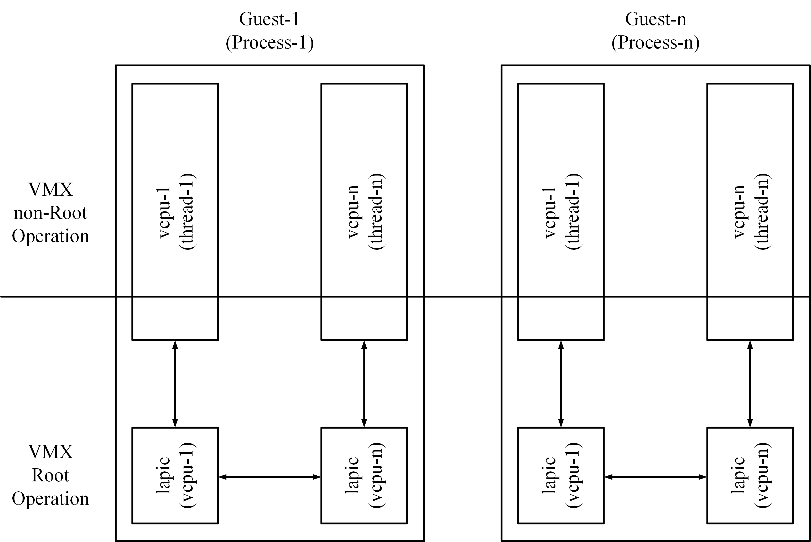
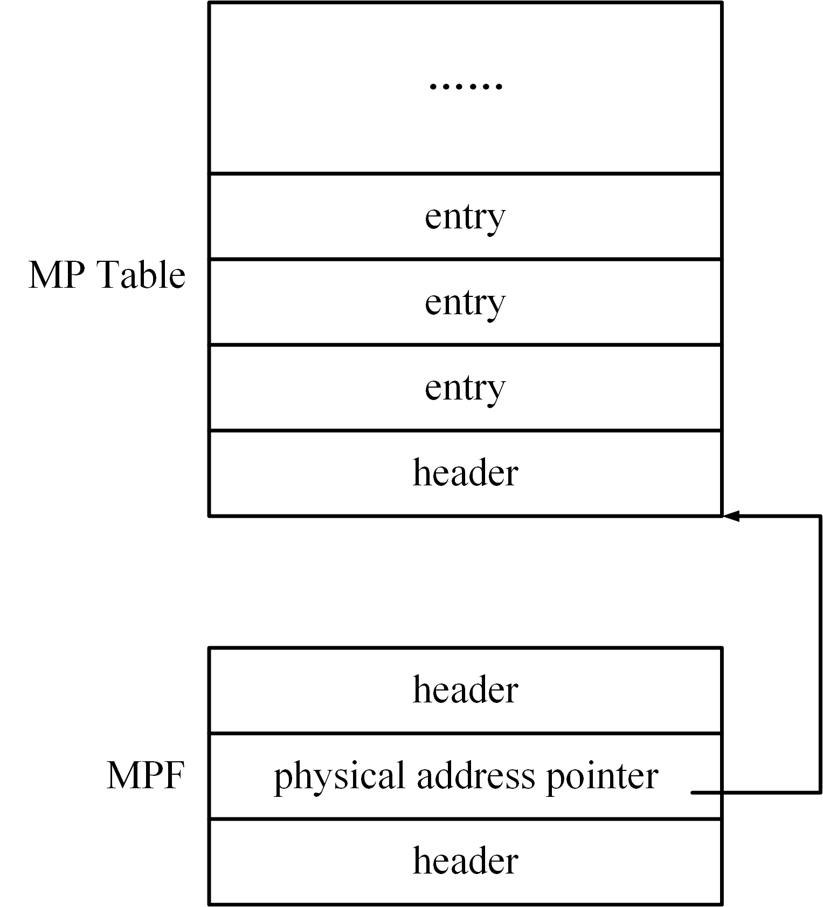
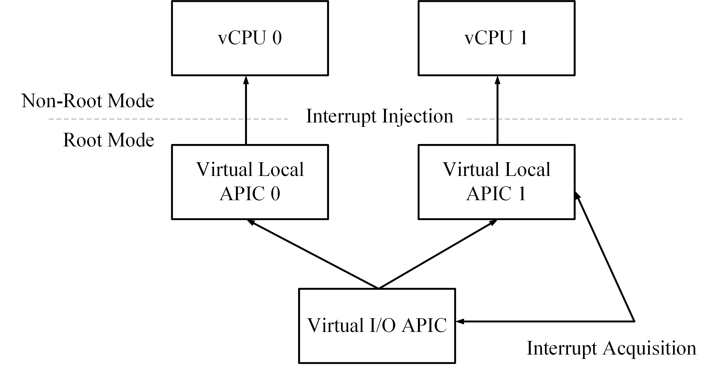

# CPU 虚拟化

## 概述
在配置 KVM、guest memory 后，开始配置 vCPU。通过 dbs-boot、dbs-arch、kvm-ioctls crates 完成。

1. dbs-arch：包含了 CPU 架构相关的仓库，例如 CPUID、MSR 寄存器的定义，CPU 虚拟化过程中会用到这些寄存器 / CPUID。
1. dbs-boot：启动过程中会用到的仓库，其中 MPTable 会和初始 CPU 个数等信息相关。
1. kvm-ioctls：其中会涉及到 create_vcpu 等 CPU 虚拟化相关 ioctl 以及 vCPU 相关 fd vcpuf。

## 步骤
创建 KvmVm 时，配置 MPTable，创建 KVM irqchip，创建 vCPU。

1. 配置 MPTable。告诉 Guest 操作系统多处理器配置，即使使用单个 vCPU 也是必需的。
1. 创建 KVM irqchip。创建虚拟 IOAPIC 和虚拟 PIC，并为 LAPIC 设置未来的 vCPU。
1. 创建 vCPU。为每个 vCPU 向 KVM 注册一个 fd。
   1. 配置 CPUID。必须。因为它是 Guest 识别自身是被虚拟化的方式。
   1. 配置 MSR。这些寄存器控制（除其他外）处理器功能。
   1. 配置其他寄存器（kvm_regs、kvm_sregs、fpu）和 LAPIC。

## MPTable
##### 原理介绍
对称多处理器（Symmetrical Multi-Processing），简称 SMP，指在一个计算机上汇集了一组处理器。在这种架构中，一台计算机由多个处理器组成，所有的处理器都可以平等地访问内存、I/O 和外部中断，运行操作系统的单一副本， 并共享内存和其他资源。操作系统将任务均匀地分布在多个 CPU 中，从而极大地提高了整个系统的数据处理能力。在虚拟 SMP 系统时，每个 CPU 使用一个线程来模拟，如下图所示。


> From：深度探索Linux系统虚拟化原理与实现


其中有两个主要部分需要考虑：一是 KVM 需要把这些 VCPU 的信息告知 Guest，这样 Guest 才可以充分利用多处理器资源；二是多处理器系统只能由一个处理器准备基础环境，这些环境准备工作如果由多个处理器不加保护地并发执行，将会带来灾难，此时其他处理器都必须处于停止状态，当基础环境准备好后，其他处理器再启动运行。

为了获得处理器信息，操作系统有两种获取处理器信息的方式：一种是 Intel 的 Multi Processor Specification（后续简称 MP Spec）约定的方式；另外一种是 ACPI MADT（Multiple APIC Description Table）约定的方式。MP Spec 约定的核心数据结构包括两部分：MP Floating Pointer Structure（后续简称 MPF）和 MP  Configuration Table（后续简称 MP Table）的地址，如下图所示。


> From：深度探索Linux系统虚拟化原理与实现


处理器的信息记录于 MP Table，MP Table 包含多个entry，entry 分为不同的类型，有的 entry 是描述处理器信息的，有的 entry 是描述总线信息的，有的 entry 是描述中断信息的，等等。每个处理器类型的 entry 记录了一个处理器的信息。
而 MP Table 地址记录在 MPF 中，MP 标准约定 MPF 可以存放在如下几个位置：

1. 存放在BIOS扩展数据区的前1KB内。
1. 系统基础内存最高的 1KB 内。比如对于 640KB 内存，那么 MPF 存放在 639KB ~ 640KB 内。
1. 存放在主板 BIOS 区域，即 0xF0000 ~ 0xFFFFF 之间。

操作系统启动时，将在 MPSpec 约定的位置搜索 MPF。那么操作系统如何确定何处内存为 MPF 呢？根据 MP Spec 约定，MPF 起始的 4 字节为 `_ MP_`。在定位了 MPF 后，操作系统就可以顺藤摸瓜，找到 MP Table，从中获取处理器信息。

##### 代码解读
在 Miniball 中使用 `dbs-boot` crate 的 `setup_mptable()` 对 MP Table 进行配置。代码如下：

```rust
#[cfg(target_arch = "x86_64")]        
mptable::setup_mptable(guest_memory, vm.config.num_vcpus, vm.config.num_vcpus)
.map_err(Error::MpTable)?;
```

在 `setup_mptable()` 中，第 5～7 行，首先判断 boot_cpus 是否超过给定的 max_cpus，以及第 8～9 行，判断 max_cpus 是否大于系统支持的最大 CPU 数目（MAX_SUPPORTED_CPUS）。之后，Miniball 将 MP Table 放置在主板 BIOS 所在的区域（0xF0000 ～ 0xFFFFF），在 BIOS 实际占据地址的末尾处。Miniball 首先申请了一块内存区，在其中组织 MPF 和 MP Table，然后将组织好的数据结构复制到 Guest 中主板 BIOS 所在的区域。代码如下：

```rust
crates/dbs-boot/src/x86_64/mptable.rs

/// Performs setup of the MP table for the given `num_cpus`
pub fn setup_mptable<M: GuestMemory>(mem: &M, boot_cpus: u8, max_cpus: u8) -> Result<()> {
    if boot_cpus > max_cpus {
        return Err(Error::TooManyBootCpus);
    }
    if u32::from(max_cpus) > MAX_SUPPORTED_CPUS {
        return Err(Error::TooManyCpus);
    }

    // Used to keep track of the next base pointer into the MP table.
    let mut base_mp = GuestAddress(MPTABLE_START);

    let mp_size = compute_mp_size(max_cpus);

    let mut checksum: u8 = 0;
    let ioapicid: u8 = max_cpus + 1;

    // The checked_add here ensures the all of the following base_mp.unchecked_add's will be without
    // overflow.
    if let Some(end_mp) = base_mp.checked_add((mp_size - 1) as u64) {
        if !mem.address_in_range(end_mp) {
            return Err(Error::NotEnoughMemory);
        }
    } else {
        return Err(Error::AddressOverflow);
    }

    mem.read_from(base_mp, &mut io::repeat(0), mp_size)
        .map_err(|_| Error::Clear)?;

    {
        let mut mpf_intel = MpfIntelWrapper(mpspec::mpf_intel::default());
        let size = mem::size_of::<MpfIntelWrapper>() as u64;
        mpf_intel.0.signature = SMP_MAGIC_IDENT;
        mpf_intel.0.length = 1;
        mpf_intel.0.specification = 4;
        mpf_intel.0.physptr = (base_mp.raw_value() + size) as u32;
        mpf_intel.0.checksum = mpf_intel_compute_checksum(&mpf_intel.0);
        mem.write_obj(mpf_intel, base_mp)
            .map_err(|_| Error::WriteMpfIntel)?;
        base_mp = base_mp.unchecked_add(size);
    }

    // We set the location of the mpc_table here but we can't fill it out until we have the length
    // of the entire table later.
    let table_base = base_mp;
    base_mp = base_mp.unchecked_add(mem::size_of::<MpcTableWrapper>() as u64);

    {
        let size = mem::size_of::<MpcCpuWrapper>() as u64;
        for cpu_id in 0..max_cpus {
            let mut mpc_cpu = MpcCpuWrapper(mpspec::mpc_cpu::default());
            mpc_cpu.0.type_ = mpspec::MP_PROCESSOR as u8;
            mpc_cpu.0.apicid = cpu_id;
            mpc_cpu.0.apicver = APIC_VERSION;
            if cpu_id < boot_cpus {
                mpc_cpu.0.cpuflag |= mpspec::CPU_ENABLED as u8;
            }
            if cpu_id == 0 {
                mpc_cpu.0.cpuflag |= mpspec::CPU_BOOTPROCESSOR as u8;
            }
            mpc_cpu.0.cpufeature = CPU_STEPPING;
            mpc_cpu.0.featureflag = CPU_FEATURE_APIC | CPU_FEATURE_FPU;
            mem.write_obj(mpc_cpu, base_mp)
                .map_err(|_| Error::WriteMpcCpu)?;
            base_mp = base_mp.unchecked_add(size);
            checksum = checksum.wrapping_add(compute_checksum(&mpc_cpu.0));
        }
    }

    {
        let size = mem::size_of::<MpcBusWrapper>() as u64;
        let mut mpc_bus = MpcBusWrapper(mpspec::mpc_bus::default());
        mpc_bus.0.type_ = mpspec::MP_BUS as u8;
        mpc_bus.0.busid = BUS_ID_ISA;
        mpc_bus.0.bustype = BUS_TYPE_ISA;
        mem.write_obj(mpc_bus, base_mp)
            .map_err(|_| Error::WriteMpcBus)?;
        base_mp = base_mp.unchecked_add(size);
        checksum = checksum.wrapping_add(compute_checksum(&mpc_bus.0));
    }

    {
        let size = mem::size_of::<MpcIoapicWrapper>() as u64;
        let mut mpc_ioapic = MpcIoapicWrapper(mpspec::mpc_ioapic::default());
        mpc_ioapic.0.type_ = mpspec::MP_IOAPIC as u8;
        mpc_ioapic.0.apicid = ioapicid;
        mpc_ioapic.0.apicver = APIC_VERSION;
        mpc_ioapic.0.flags = mpspec::MPC_APIC_USABLE as u8;
        mpc_ioapic.0.apicaddr = IO_APIC_DEFAULT_PHYS_BASE;
        mem.write_obj(mpc_ioapic, base_mp)
            .map_err(|_| Error::WriteMpcIoapic)?;
        base_mp = base_mp.unchecked_add(size);
        checksum = checksum.wrapping_add(compute_checksum(&mpc_ioapic.0));
    }
    // Per kvm_setup_default_irq_routing() in kernel
    for i in 0..16 {
        let size = mem::size_of::<MpcIntsrcWrapper>() as u64;
        let mut mpc_intsrc = MpcIntsrcWrapper(mpspec::mpc_intsrc::default());
        mpc_intsrc.0.type_ = mpspec::MP_INTSRC as u8;
        mpc_intsrc.0.irqtype = mpspec::mp_irq_source_types_mp_INT as u8;
        mpc_intsrc.0.irqflag = mpspec::MP_IRQDIR_DEFAULT as u16;
        mpc_intsrc.0.srcbus = BUS_ID_ISA;
        mpc_intsrc.0.srcbusirq = i;
        mpc_intsrc.0.dstapic = ioapicid;
        mpc_intsrc.0.dstirq = i;
        mem.write_obj(mpc_intsrc, base_mp)
            .map_err(|_| Error::WriteMpcIntsrc)?;
        base_mp = base_mp.unchecked_add(size);
        checksum = checksum.wrapping_add(compute_checksum(&mpc_intsrc.0));
    }
    {
        let size = mem::size_of::<MpcLintsrcWrapper>() as u64;
        let mut mpc_lintsrc = MpcLintsrcWrapper(mpspec::mpc_lintsrc::default());
        mpc_lintsrc.0.type_ = mpspec::MP_LINTSRC as u8;
        mpc_lintsrc.0.irqtype = mpspec::mp_irq_source_types_mp_ExtINT as u8;
        mpc_lintsrc.0.irqflag = mpspec::MP_IRQDIR_DEFAULT as u16;
        mpc_lintsrc.0.srcbusid = 0;
        mpc_lintsrc.0.srcbusirq = 0;
        mpc_lintsrc.0.destapic = 0;
        mpc_lintsrc.0.destapiclint = 0;
        mem.write_obj(mpc_lintsrc, base_mp)
            .map_err(|_| Error::WriteMpcLintsrc)?;
        base_mp = base_mp.unchecked_add(size);
        checksum = checksum.wrapping_add(compute_checksum(&mpc_lintsrc.0));
    }
    {
        let size = mem::size_of::<MpcLintsrcWrapper>() as u64;
        let mut mpc_lintsrc = MpcLintsrcWrapper(mpspec::mpc_lintsrc::default());
        mpc_lintsrc.0.type_ = mpspec::MP_LINTSRC as u8;
        mpc_lintsrc.0.irqtype = mpspec::mp_irq_source_types_mp_NMI as u8;
        mpc_lintsrc.0.irqflag = mpspec::MP_IRQDIR_DEFAULT as u16;
        mpc_lintsrc.0.srcbusid = 0;
        mpc_lintsrc.0.srcbusirq = 0;
        mpc_lintsrc.0.destapic = 0xFF; /* to all local APICs */
        mpc_lintsrc.0.destapiclint = 1;
        mem.write_obj(mpc_lintsrc, base_mp)
            .map_err(|_| Error::WriteMpcLintsrc)?;
        base_mp = base_mp.unchecked_add(size);
        checksum = checksum.wrapping_add(compute_checksum(&mpc_lintsrc.0));
    }

    // At this point we know the size of the mp_table.
    let table_end = base_mp;

    let mpc_table_size = mem::size_of::<MpcTableWrapper>() as u64;
    base_mp = base_mp.unchecked_add(mpc_table_size);
    let oem_count = 0;
    let oem_size = 0;
    let oem_ptr = base_mp;

    {
        let mut mpc_table = MpcTableWrapper(mpspec::mpc_table::default());
        mpc_table.0.signature = MPC_SIGNATURE;
        // it's safe to use unchecked_offset_from because
        // table_end > table_base
        mpc_table.0.length = table_end.unchecked_offset_from(table_base) as u16;
        mpc_table.0.spec = MPC_SPEC;
        mpc_table.0.oem = MPC_OEM;
        mpc_table.0.oemcount = oem_count;
        mpc_table.0.oemptr = oem_ptr.0 as u32;
        mpc_table.0.oemsize = oem_size as u16;
        mpc_table.0.productid = MPC_PRODUCT_ID;
        mpc_table.0.lapic = APIC_DEFAULT_PHYS_BASE;
        checksum = checksum.wrapping_add(compute_checksum(&mpc_table.0));
        mpc_table.0.checksum = (!checksum).wrapping_add(1) as i8;
        mem.write_obj(mpc_table, table_base)
            .map_err(|_| Error::WriteMpcTable)?;
    }

    Ok(())
}
```

首先，第 13 行，获取到 MP 的基指针，第 15 行，提前获取所有待组织 entry 的总和大小。第 22～28 行，`checked_add()` 使用 mp_size 预先确保以下所有 base_mp.unchecked_add 都没有溢出。
在组织 MP Table 前，首先开始组织 MPF，见第 33～44 行，MPF 紧邻 MP Table，其中字段 physptr 指向了 MP Table。
后面就是组织各种 entry 了。首先是处理器类型 entry，见第 51～71 行。MP Spec 约定，在处理器类型的 entry 中，需要提供处理器对应的 LAPIC 的 ID，作为发送核间中断时的目的地址。根据代码可见，0 号 CPU 对应的 LAPIC 的 ID 为 0，1 号 CPU 对应的 LAPIC 的 ID 为 1，以此类推。
在处理器之后，还有各种总线、中断等 entry，见代码第 73～143 行，这里我们不一一介绍了。
最后，mpc_table 申请一块临时的内存区，见第 155 行。根据 MP Table 的大小和起始点计算结束点。之后，将 mpc_table 写入到 table_base 的位置。

## KVM irqchip
### irqchip
##### 原理介绍
中断从设备发送到CPU需要经过中断控制器，现代x86架构采用的中断控制器被称为APIC(Advanced Programmable Interrupt Controller)。APIC是伴随多核处理器产生的，所有的核共用一个I/O APIC，用于统一接收来自外部I/O设备的中断，而后根据软件的设定，格式化出一条包含该中断所有信息的Interrupt Message，发送给对应的CPU。

每个核有一个Local APIC，用于接收来自I/O APIC的Interrupt Message，内部的时钟和温控中断，以及来自其他核的中断，也就是IPI(Inter-Processor Interrupt)。

在虚拟化环境中，VMM需要为guest VM展现一个与物理中断架构类似的虚拟中断架构。每个vCPU都对应一个虚拟的Local APIC，多个虚拟CPU共享一个虚拟的I/O APIC。

和虚拟CPU一样，虚拟的Local APIC和虚拟的I/O APIC都是VMM维护的软件实体（以下统称虚拟中断控制器）。中断虚拟化的主要任务就是实现下图描述的虚拟中断架构，包括虚拟中断控制器的创建，中断采集和中断注入。



###### 中断采集
中断的采集是指将guest VM的设备中断请求送入对应的虚拟中断控制器中。Guest VM的中断有两种可能的来源：

- 来自于软件模拟的虚拟设备，比如一个模拟出来的串口，可以产生一个虚拟中断。从VMM的角度来看，虚拟设备只是一个软件模块，可以通过调用虚拟中断控制器提供的接口函数，实现虚拟设备的中断发送。
- 来自于直接分配给guest VM的物理设备的中断，比如一个物理网卡，可以产生一个真正的物理中断。一个物理设备被直接分配给一个guest VM，意味着当该设备发生中断时，中断的处理函数（ISR）应该位于guest OS中。

在虚拟化环境中，物理中断控制器是由VMM控制的，因而VMM在收到中断后，会首先判断该中断是不是由分配给guest VM的设备产生的，如果是的话，就将中断发送给对应的虚拟中断控制器。而后，虚拟中断控制器会在适当的时机将该中断注入guest VM，由guest OS中的ISR进行处理。

###### 中断注入
虚拟中断控制器采集到的中断请求，将按照VMM排定的优先级，被逐一注入到对应的虚拟CPU中。在Linux的信号发送与接收机制中，只有从内核空间返回到用户空间，也就是某个进程被调度到重新获得CPU的使用权时，该进程才可以处理之前发送给它的那些信号，或者说此时内核才可以将这些未处理的信号注入到进程中。

同样地，只有在VM entry，也就是某个虚拟CPU被调度到重新获得物理CPU的使用权时，VMM才可以将中断注入到该虚拟CPU中。

为了保证中断的及时注入，就需要通过一定的手段，强制虚拟CPU发生VM exit，然后在VM entry返回guest VM的时候注入中断。强制产生VM exit最常用的办法就是往虚拟CPU对应的物理CPU发送一个IPI核间中断。

VMM注入的中断虚拟CPU并非全部接收。Linux中的进程可以通过设置SIG_IGN来忽略某个信号（SIGKILL和SIGSTOP除外），同样地，虚拟CPU也可以通过配置虚拟IMR(Interrupt Mask Register)来选择是否屏蔽某个中断。

###### irqchip
“irqchip”是KVM对通常称为“中断控制器”的名称。这是一种硬件，它接收大量中断信号（来自USB控制器，磁盘控制器，PCI卡，串行端口等设备），并以一种允许CPU控制启用哪些中断，在新中断到达时通知，消除已处理的中断等方式将它们呈现给CPU。

VM 需要仿真中断控制器，就像实际硬件具有真正的硬件中断控制器一样。在 KVM VM 中，可以像所有其他模拟设备一样将此模拟设备置于用户空间 （如 QEMU） 中。但是，由于中断控制器与模拟中断的处理密切相关，因此在来宾操作中断控制器时，必须在内核和用户空间之间频繁地来回切换，这对性能不利。因此，KVM在内核中提供了一个中断控制器（“内核内irqchip”）的仿真，QEMU可以使用该控制器，而不是在用户空间中提供自己的版本。


##### 代码解读
在 x86_64 上，必须在 vCPU 之前创建 irqchip。 它设置虚拟 IOAPIC、虚拟 PIC，并为 LAPIC 设置未来的 vCPU。 如有疑问，请在[内核中查找 KVM_CREATE_IRQCHIP](https://elixir.bootlin.com/linux/latest/source/arch/x86/kvm/x86.c)。

```rust
#[cfg(target_arch = "x86_64")]
fn setup_irq_controller(&self) -> Result<()> {
    self.fd
        .create_irq_chip()
        .map_err(Error::SetupInterruptController)?;
}
```

### pit

##### 原理介绍
PIT是周期中断定时器。PIT定时器是32位递减计数器，每一个时钟周期减1。每次计时器达到0时它将生成一个触发脉冲并设置中断标志，然后再次加载相应的启动值。PIT定时器常用于为其他外设提供周期信号，例如ADC利用PIT设置采样周期，DMA可以使用PIT设置周期性的DMA传输。

##### 代码解读
PIT 在引导期间用于配置频率。 PIT 通道 0 的输出连接到 PIC 芯片，因此它产生一个“IRQ 0”（系统定时器），详细[参考](https://wiki.osdev.org/Programmable_Interval_Timer)。

设置扬声器 PIT，因为某些内核在启动期间访问扬声器端口。 没有这个，KVM 将不断退出到用户空间。

```rust
fn setup_irq_controller(&self) -> Result<()> {
    ...

    let pit_config = kvm_pit_config {
        flags: KVM_PIT_SPEAKER_DUMMY,
        ..Default::default()
    };
    self.fd
        .create_pit2(pit_config)
        .map_err(Error::SetupInterruptController)
}
```

## vCPU
##### 代码解读
在创建好 Guest 内存的基础上，我们前面已经配置了 `MP Table` 和 `KVM irqchip`，接下来我们要创建运行指令的寄存器。在 Miniball 中，通过 `create_vcpus()` 创建 KvmVcpu，见第 11～ 18 行。在 `KvmVcpu` 结构体中包含 vCPU 的文件描述符 VcpuFd、总线访问的设备管理器、vCPU 的配置信息、vCPU 的运行状态等。

```rust
pub struct KvmVcpu {
    /// KVM file descriptor for a vCPU.
    pub(crate) vcpu_fd: VcpuFd,
    /// Device manager for bus accesses.
    device_mgr: Arc<Mutex<IoManager>>,
    config: VcpuConfig,
    run_barrier: Arc<Barrier>,
    pub(crate) run_state: Arc<VcpuRunState>,
}
```

```rust
fn create_vcpus<M: GuestMemory>(
    &mut self,
    bus: Arc<Mutex<IoManager>>,
    vcpus_config: VcpuConfigList,
    memory: &M,
) -> Result<()> {
    self.vcpus = vcpus_config
    .configs
    .iter()
    .map(|config| {
        KvmVcpu::new(
            &self.fd,
            bus.clone(),
            config.clone(),
            self.vcpu_barrier.clone(),
            self.vcpu_run_state.clone(),
            memory,
        )
    })
    .collect::<vcpu::Result<Vec<KvmVcpu>>>()
    .map_err(Error::CreateVcpu)?;
    #[cfg(target_arch = "aarch64")]
    self.setup_irq_controller()?;

    Ok(())
}
```

创建 KvmVcpu 时需要通过 `kvm-ioctls` crate 的 `create_vcpu()` 。在创建 KvmVcpu 后需要配置 CPUID、MSR、REG、SREG、FPU 和 LAPIC。

```rust
pub fn new<M: GuestMemory>(
    vm_fd: &VmFd,
    device_mgr: Arc<Mutex<IoManager>>,
    config: VcpuConfig,
    run_barrier: Arc<Barrier>,
    run_state: Arc<VcpuRunState>,
    memory: &M,
) -> Result<Self> {
    #[cfg(target_arch = "x86_64")]
    let vcpu;
    #[cfg(target_arch = "aarch64")]
    let mut vcpu;

    vcpu = KvmVcpu {
        vcpu_fd: vm_fd
        .create_vcpu(config.id.into())
        .map_err(Error::KvmIoctl)?,
        device_mgr,
        config,
        run_barrier,
        run_state,
    };

    #[cfg(target_arch = "x86_64")]
    {
        vcpu.configure_cpuid(&vcpu.config.cpuid)?;
        vcpu.configure_msrs()?;
        vcpu.configure_sregs(memory)?;
        vcpu.configure_lapic()?;
        vcpu.configure_fpu()?;
    }

    #[cfg(target_arch = "aarch64")]
    {
        vcpu.init(vm_fd)?;
        vcpu.configure_regs(memory)?;
    }

    Ok(vcpu)
}
```

第 6 行，KVM 模块为用户空间提供的 API 为 `KVM_CREATE_VCPU()`，这个 API 接收一个参数 vcpu id，本质上是 lapci id。

```rust
kvm-ioctls/src/ioctls/vm.rs

pub fn create_vcpu(&self, id: u64) -> Result<VcpuFd> {
    // Safe because we know that vm is a VM fd and we verify the return result.
    #[allow(clippy::cast_lossless)]
    let vcpu_fd = unsafe { ioctl_with_val(&self.vm, KVM_CREATE_VCPU(), id as c_ulong) };
    if vcpu_fd < 0 {
        return Err(errno::Error::last());
    }

    // Wrap the vCPU now in case the following ? returns early. This is safe because we verified
    // the value of the fd and we own the fd.
    let vcpu = unsafe { File::from_raw_fd(vcpu_fd) };

    let kvm_run_ptr = KvmRunWrapper::mmap_from_fd(&vcpu, self.run_size)?;

    Ok(new_vcpu(vcpu, kvm_run_ptr))
}
```

### 配置 CPUID、MSR、其他寄存器
通过 KVM vCPU 的文件描述符 Fd 来配置 CPUID、MSR、REG、SREG、FPU 和 LAPIC。fd 是创建的指向特定虚拟机实例的文件描述符，之后利用这个 fd 发送命令给 VM 进行访问控制。

需要配置的内容如下：

- CPUID
- MSR
- REG
- SREG
- FPU
- LAPIC

#### CPUID
##### 代码解读
在 Miniball 中，配置 CPUID，应该首先使用 `kvm-ioctls` crate 的 `KVM_GET_CPUID2()` 来获取`原始 CPUID`，然后使用 `dbs-arch` crate 提供的 `VmSpec` 来描述我们想要的 VM 规范，并使用 `process_cpuid()` 来过滤包含所需信息且适合  `kvm-ioctls` crate  条件的 CPUID。

首先，需要使用`kvm-ioctls` crate 的 `KVM_GET_CPUID2()` 来获取原始 CPUID。
```rust
// an example for getting the cpuid in the vmm.
let mut cpuid = CpuId::new(num_entries).map_err(|_| errno::Error::new(libc::ENOMEM))?;
let ret = unsafe {ioctl_with_mut_ptr(self, KVM_GET_CPUID2(), cpuid.as_mut_fam_struct_ptr())};
if ret != 0 {
    return Err(errno::Error::last());
}
```

然后，第 1～9 行，我们可以创建 `VmSpec` 来描述我们想要的 VM 规范。第 11～15 行使用 `process_cpuid()` 来过滤 CPUID。第 17～19 行，过滤后我们可以使用它来设置 guest 的 CPUID。

```rust
let cpuid_vm_spec = VmSpec::new(
    self.id,
    vcpu_config.max_all_vcpu_count as u8,
    vcpu_config.threads_per_core,
    vcpu_config.cores_per_die,
    vcpu_config.dies_per_socket,
    vcpu_config.vpmu_feature,
)
.map_err(VcpuError::CpuId)?;

process_cpuid(&mut self.cpuid, &cpuid_vm_spec).map_err(|e| {
    METRICS.vcpu.process_cpuid.inc();
    error!("Failure in configuring CPUID for vcpu {}: {:?}", self.id, e);
    VcpuError::CpuId(e)
})?;

self.fd
    .set_cpuid2(&self.cpuid)
    .map_err(VcpuError::SetSupportedCpusFailed)
```

```rust
crates/dbs-arch/src/x86_64/cpuid/mod.rs

pub fn process_cpuid(kvm_cpuid: &mut CpuId, vm_spec: &VmSpec) -> Result<(), Error> {
    use transformer::CpuidTransformer;

    match vm_spec.cpu_vendor_id() {
        self::common::VENDOR_ID_INTEL => {
            self::transformer::intel::IntelCpuidTransformer::new().process_cpuid(kvm_cpuid, vm_spec)
        }
        self::common::VENDOR_ID_AMD => {
            self::transformer::amd::AmdCpuidTransformer::new().process_cpuid(kvm_cpuid, vm_spec)
        }
        _ => Err(Error::CpuNotSupported),
    }
}
```

```rust
kvm-ioctls/src/ioctls/vcpu.rs

#[cfg(any(target_arch = "x86", target_arch = "x86_64"))]
pub fn set_cpuid2(&self, cpuid: &CpuId) -> Result<()> {
    let ret = unsafe {
        // Here we trust the kernel not to read past the end of the kvm_cpuid2 struct.
        ioctl_with_ptr(self, KVM_SET_CPUID2(), cpuid.as_fam_struct_ptr())
    };
    if ret < 0 {
        return Err(errno::Error::last());
    }
    Ok(())
}
```

#### MSR
##### 原理介绍
MSR（Model Specific Register）是 x86 架构中的概念，指的是在x86架构处理器中，一系列用于控制CPU运行、功能开关、调试、跟踪程序执行、监测 CPU 性能等方面的寄存器。
MSR 寄存器的雏形开始于 Intel 80386 和 80486 处理器，到 Intel Pentium 处理器的时候，Intel 就正式引入 RDMSR 和 WRMSR 两个指令用于读和写 MSR 寄存器，这个时候 MSR 就算被正式引入。在引入 RDMSR 和 WRMSR 指令的同时，也引入了 CPUID 指令，该指令用于指明具体的 CPU 芯片中，哪些功能是可用的，或者这些功能对应的 MSR 寄存器是否存在，软件可以通过 CPUID 指令查询某些功能是否在当前 CPU 上是否支持。
每个 MSR 寄存器都会有一个相应的 ID，即 MSR Index，或者也叫作 MSR 寄存器地址，当执行 RDMSR 或者 WRMSR 指令的时候，只要提供 MSR Index 就能让 CPU 知道目标 MSR 寄存器。这些 MSR 寄存器的编号（MSR Index）、名字及其各个数据区域的定义可以在 Intel x86 架构手册 [Intel 64 and IA-32 Architectures Software Developer's Manual](https://www.google.com.hk/url?sa=t&rct=j&q=&esrc=s&source=web&cd=&ved=2ahUKEwjwi5-f_p35AhUYAKYKHSrhDs4QFnoECAwQAQ&url=https%3A%2F%2Fwww.intel.com%2Fcontent%2Fdam%2Fwww%2Fpublic%2Fus%2Fen%2Fdocuments%2Fmanuals%2F64-ia-32-architectures-software-developer-vol-3b-part-2-manual.pdf&usg=AOvVaw1U4quQu59Xnooiir4d1Adc) 的 Volume 4 中找到。

##### 代码解读
在 Miniball 中通过 `dbs-arch` crate 的 `setup_msrs()` 来配置 MSRs，通过 `dbs-arch` crate 的 `create_msr_entries()` 获取到启动虚拟机需要配置的 MSRs，传入 `kvm-ioctls` crate 的 `set_msrs()` 中对 MSRs 进行设置：

```rust
dbs_arch::regs::setup_msrs(&self.fd).map_err(VcpuError::MSRSConfiguration)?;
```

```rust
dbs-arch/src/x86_64/regs.rs

/// Configure Model Specific Registers (MSRs) for a given CPU.
pub fn setup_msrs(vcpu: &VcpuFd) -> Result<()> {
    let entry_vec = create_msr_entries();
    let kvm_msrs =
        Msrs::from_entries(&entry_vec).map_err(|_| Error::SetModelSpecificRegistersCount)?;

    vcpu.set_msrs(&kvm_msrs)
        .map_err(Error::SetModelSpecificRegisters)
        .and_then(|msrs_written| {
            if msrs_written as u32 != kvm_msrs.as_fam_struct_ref().nmsrs {
                Err(Error::SetModelSpecificRegistersCount)
            } else {
                Ok(msrs_written)
            }
        })?;
    Ok(())
}
```

```rust
crates/dbs-arch/src/x86_64/regs.rs

#[allow(clippy::vec_init_then_push)]
fn create_msr_entries() -> Vec<kvm_msr_entry> {
    let mut entries = Vec::<kvm_msr_entry>::new();

    entries.push(kvm_msr_entry {
        index: msr::MSR_IA32_SYSENTER_CS,
        data: 0x0,
        ..Default::default()
    });
    entries.push(kvm_msr_entry {
        index: msr::MSR_IA32_SYSENTER_ESP,
        data: 0x0,
        ..Default::default()
    });
    entries.push(kvm_msr_entry {
        index: msr::MSR_IA32_SYSENTER_EIP,
        data: 0x0,
        ..Default::default()
    });
    // x86_64 specific msrs, we only run on x86_64 not x86.
    entries.push(kvm_msr_entry {
        index: msr::MSR_STAR,
        data: 0x0,
        ..Default::default()
    });
    entries.push(kvm_msr_entry {
        index: msr::MSR_CSTAR,
        data: 0x0,
        ..Default::default()
    });
    entries.push(kvm_msr_entry {
        index: msr::MSR_KERNEL_GS_BASE,
        data: 0x0,
        ..Default::default()
    });
    entries.push(kvm_msr_entry {
        index: msr::MSR_SYSCALL_MASK,
        data: 0x0,
        ..Default::default()
    });
    entries.push(kvm_msr_entry {
        index: msr::MSR_LSTAR,
        data: 0x0,
        ..Default::default()
    });
    // end of x86_64 specific code
    entries.push(kvm_msr_entry {
        index: msr::MSR_IA32_TSC,
        data: 0x0,
        ..Default::default()
    });
    entries.push(kvm_msr_entry {
        index: msr::MSR_IA32_MISC_ENABLE,
        data: u64::from(msr::MSR_IA32_MISC_ENABLE_FAST_STRING),
        ..Default::default()
    });

    entries
}
```

```rust
kvm-ioctls/src/ioctls/vcpu.rs

/// Setup the model-specific registers (MSR) for this vCPU.
#[cfg(any(target_arch = "x86", target_arch = "x86_64"))]
pub fn set_msrs(&self, msrs: &Msrs) -> Result<usize> {
    let ret = unsafe {
        // Here we trust the kernel not to read past the end of the kvm_msrs struct.
        ioctl_with_ptr(self, KVM_SET_MSRS(), msrs.as_fam_struct_ptr())
    };
    // KVM_SET_MSRS actually returns the number of msr entries written.
    if ret < 0 {
        return Err(errno::Error::last());
    }
    Ok(ret as usize)
}
```

#### REG
##### 原理介绍
REG 包含通用寄存器、标志寄存器、指令指针寄存器 rip。

- rflags：rflags 寄存器，按照 [Intel 手册](https://software.intel.com/sites/default/files/managed/39/c5/325462-sdm-vol-1-2abcd-3abcd.pdf#page=79)要求，将第 2 位设置为1，其他位全部初始化为0。
- rip：boot_ip 启动指令指针。
- rsp：起始栈指针。
- rbp：帧指针。它获取堆栈指针 (rsp) 的快照，因此当对 rsp 进行调整（即为局部变量保留空间或将值压入堆栈）时，仍然可以从 rbp 的恒定偏移量访问局部变量和函数参数。
- rsi：每个 Linux ABI 必须指向零页地址。这是 x86_64 特定的。

##### 代码解读
在 Miniball 中通过 `dbs-arch` crate 的 `setup_regs()` 来配置 REGs，将寄存器设置的值传入 `kvm-ioctls` crate 的 `set_regs()` 中对 REGs 进行设置。使用`kvm-ioctls` crate 的 `KVM_SET_REGS()` 来设置 REG 寄存器。代码如下：

```rust
dbs_arch::regs::setup_regs(
    &self.fd,
    start_addr.raw_value() as u64,
    dbs_boot::layout::BOOT_STACK_POINTER,
    dbs_boot::layout::BOOT_STACK_POINTER,
    dbs_boot::layout::ZERO_PAGE_START,
)
.map_err(VcpuError::REGSConfiguration)?;
```

```rust
dbs-arch/src/x86_64/regs.rs

pub fn setup_regs(vcpu: &VcpuFd, boot_ip: u64, rsp: u64, rbp: u64, rsi: u64) -> Result<()> {
    let regs: kvm_regs = kvm_regs {
        rflags: 0x0000_0000_0000_0002u64,
        rip: boot_ip,
        rsp,
        rbp,
        rsi,
        ..Default::default()
    };

    vcpu.set_regs(&regs).map_err(Error::SetBaseRegisters)
}
```

```rust
kvm-ioctls/src/ioctls/vcpu.rs

#[cfg(not(any(target_arch = "arm", target_arch = "aarch64")))]
pub fn set_regs(&self, regs: &kvm_regs) -> Result<()> {
    // Safe because we know that our file is a vCPU fd, we know the kernel will only read the
    // correct amount of memory from our pointer, and we verify the return result.
    let ret = unsafe { ioctl_with_ref(self, KVM_SET_REGS(), regs) };
    if ret != 0 {
        return Err(errno::Error::last());
    }
    Ok(())
}
```

#### SREG
##### 原理介绍
SREG 包含段寄存器、控制寄存器。

- ds：数据段
- ss：栈段
- cs：代码段
- es：扩展段

##### 代码解读
在 Miniball 中通过 `dbs-arch` crate 的 `setup_sregs()` 来配置 SREGs，将寄存器设置的值传入 `kvm-ioctls` crate 的 `set_sregs()` 中对 SREGs 进行设置。使用`kvm-ioctls` crate 的 `KVM_SET_SREGS()` 来设置 SREG 寄存器。
需要输入的内容：

- pgtable_addr：vcpu pgtable 的地址。
   - pgtable：初始化客户内存范围[0..1G)的1:1标识映射表。另外，pml4 地址用于 sregs 设置和 AP 启动。
- gdt_table：全局描述符表的内容。
- gdt_addr：全局描述符表的地址。
- idt_addr：中断描述符表的地址。

代码如下：

```rust
let gdt_table: [u64; dbs_boot::layout::BOOT_GDT_MAX as usize] = [
    gdt_entry(0, 0, 0),            // NULL
    gdt_entry(0xa09b, 0, 0xfffff), // CODE
    gdt_entry(0xc093, 0, 0xfffff), // DATA
    gdt_entry(0x808b, 0, 0xfffff), // TSS
];
let pgtable_addr =
dbs_boot::setup_identity_mapping(&*vm_as.memory()).map_err(VcpuError::PageTable)?;
dbs_arch::regs::setup_sregs(
    &*vm_as.memory(),
    &self.fd,
    pgtable_addr,
    &gdt_table,
    dbs_boot::layout::BOOT_GDT_OFFSET,
    dbs_boot::layout::BOOT_IDT_OFFSET,
)
.map_err(VcpuError::SREGSConfiguration)?;
```

```rust
dbs-arch/src/x86_64/regs.rs

pub fn setup_sregs<M: GuestMemory>(
    mem: &M,
    vcpu: &VcpuFd,
    pgtable_addr: GuestAddress,
    gdt_table: &[u64],
    gdt_addr: u64,
    idt_addr: u64,
) -> Result<()> {
    let mut sregs: kvm_sregs = vcpu.get_sregs().map_err(Error::GetStatusRegisters)?;
    configure_segments_and_sregs(mem, &mut sregs, pgtable_addr, gdt_table, gdt_addr, idt_addr)?;
    vcpu.set_sregs(&sregs).map_err(Error::SetStatusRegisters)
}

fn configure_segments_and_sregs<M: GuestMemory>(
    mem: &M,
    sregs: &mut kvm_sregs,
    pgtable_addr: GuestAddress,
    gdt_table: &[u64],
    gdt_addr: u64,
    idt_addr: u64,
) -> Result<()> {
    assert!(gdt_table.len() >= 4);
    let code_seg = kvm_segment_from_gdt(gdt_table[1], 1);
    let data_seg = kvm_segment_from_gdt(gdt_table[2], 2);
    let tss_seg = kvm_segment_from_gdt(gdt_table[3], 3);

    // Write segments
    write_gdt_table(gdt_table, gdt_addr, mem)?;
    sregs.gdt.base = gdt_addr;
    sregs.gdt.limit = (mem::size_of::<u64>() * gdt_table.len()) as u16 - 1;

    write_idt_value(0, idt_addr, mem)?;
    sregs.idt.base = idt_addr;
    sregs.idt.limit = mem::size_of::<u64>() as u16 - 1;

    sregs.cs = code_seg;
    sregs.ds = data_seg;
    sregs.es = data_seg;
    sregs.fs = data_seg;
    sregs.gs = data_seg;
    sregs.ss = data_seg;
    sregs.tr = tss_seg;

    /* 64-bit protected mode */
    sregs.cr0 |= X86_CR0_PE;
    sregs.cr3 = pgtable_addr.raw_value() as u64;
    sregs.cr4 |= X86_CR4_PAE;
    sregs.cr0 |= X86_CR0_PG;
    sregs.efer |= EFER_LME | EFER_LMA;

    Ok(())
}
```

```rust
kvm-ioctls/src/ioctls/vcpu.rs

#[cfg(any(target_arch = "x86", target_arch = "x86_64"))]
pub fn set_sregs(&self, sregs: &kvm_sregs) -> Result<()> {
    // Safe because we know that our file is a vCPU fd, we know the kernel will only read the
    // correct amount of memory from our pointer, and we verify the return result.
    let ret = unsafe { ioctl_with_ref(self, KVM_SET_SREGS(), sregs) };
    if ret != 0 {
        return Err(errno::Error::last());
    }
    Ok(())
}
```

#### FPU
##### 原理介绍
FPU：浮点单元（FPU）寄存器。FPU 浮点单元由 8 个数据寄存器，1个 control 控制寄存器（也可以叫做 control word 控制字），1 个 status 状态寄存器（status word 状态字），1 个 tag 标记寄存器（tag word 标记字）组成。

##### 代码解读
在 Miniball 中通过 `dbs-arch` crate 的 `setup_fpu()` 来配置 FPU，将寄存器设置的值传入 `kvm-ioctls` crate 的 `set_fpu()` 中对 FPU 进行设置。使用`kvm-ioctls` crate 的 `KVM_SET_FPU()` 来设置 FPU 寄存器。代码如下：

```rust
dbs_arch::regs::setup_fpu(&self.fd).map_err(VcpuError::FPUConfiguration)?;
```

```rust
dbs-arch/src/x86_64/regs.rs

pub fn setup_fpu(vcpu: &VcpuFd) -> Result<()> {
    let fpu: kvm_fpu = kvm_fpu {
        fcw: 0x37f,
        mxcsr: 0x1f80,
        ..Default::default()
    };

    vcpu.set_fpu(&fpu).map_err(Error::SetFPURegisters)
}
```

```rust
kvm-ioctls/src/ioctls/vcpu.rs

#[cfg(any(target_arch = "x86", target_arch = "x86_64"))]
pub fn set_fpu(&self, fpu: &kvm_fpu) -> Result<()> {
    let ret = unsafe {
        // Here we trust the kernel not to read past the end of the kvm_fpu struct.
        ioctl_with_ref(self, KVM_SET_FPU(), fpu)
    };
    if ret < 0 {
        return Err(errno::Error::last());
    }
    Ok(())
}
```

#### LAPIC
##### 原理介绍
LAPIC (Local Advanced Programmable Interrupt Controller) 是一种负责接收 / 发送中断的芯片，集成在 CPU 内部，每个 CPU 有一个属于自己的 LAPIC。它们通过 APIC ID 进行区分。每个 LAPIC 都有自己的一系列寄存器、一个内部时钟、一个本地定时设备 和 两条 IRQ 线 LINT0 和 LINT1。

在虚拟化环境中，VMM需要为guest VM展现一个与物理中断架构类似的虚拟中断架构。每个vCPU都对应一个虚拟的Local APIC，多个虚拟CPU共享一个虚拟的I/O APIC。和虚拟CPU一样，虚拟的Local APIC和虚拟的I/O APIC都是VMM维护的虚拟中断控制器。

##### 代码梳理
在 Miniball 中通过 `dbs-arch` crate 的 `setup_lint()` 来配置 LAPIC。`get_klapic_reg()` 和 `set_klapic_reg()` 用于获取和设置寄存器。第 43 ～ 54 行，LAPIC0 设置为外部中断，LAPIC1 设置为 NMI。代码如下：

```rust
dbs_arch::interrupts::set_lint(&self.fd).map_err(VcpuError::LocalIntConfiguration)?;
```

```rust
dbs-arch/src/x86_64/interrupts.rs

// Defines poached from apicdef.h kernel header.
const APIC_LVT0: usize = 0x350;
const APIC_LVT1: usize = 0x360;
const APIC_MODE_NMI: u32 = 0x4;
const APIC_MODE_EXTINT: u32 = 0x7;

fn get_klapic_reg(klapic: &kvm_lapic_state, reg_offset: usize) -> u32 {
    let range = reg_offset..reg_offset + 4;
    let reg = klapic.regs.get(range).expect("get_klapic_reg range");

    let mut reg_bytes = [0u8; 4];
    for (byte, read) in reg_bytes.iter_mut().zip(reg.iter().cloned()) {
        *byte = read as u8;
    }

    u32::from_le_bytes(reg_bytes)
}

fn set_klapic_reg(klapic: &mut kvm_lapic_state, reg_offset: usize, value: u32) {
    let range = reg_offset..reg_offset + 4;
    let reg = klapic.regs.get_mut(range).expect("set_klapic_reg range");

    let value = u32::to_le_bytes(value);
    for (byte, read) in reg.iter_mut().zip(value.iter().cloned()) {
        *byte = read as i8;
    }
}

#[allow(unused_parens)]
fn set_apic_delivery_mode(reg: u32, mode: u32) -> u32 {
    (((reg) & !0x700) | ((mode) << 8))
}

/// Configures LAPICs.  LAPIC0 is set for external interrupts, LAPIC1 is set for NMI.
///
/// # Arguments
/// * `vcpu` - The VCPU object to configure.
pub fn set_lint(vcpu: &VcpuFd) -> Result<()> {
    let mut klapic = vcpu.get_lapic().map_err(Error::GetLapic)?;

    let lvt_lint0 = get_klapic_reg(&klapic, APIC_LVT0);
    set_klapic_reg(
        &mut klapic,
        APIC_LVT0,
        set_apic_delivery_mode(lvt_lint0, APIC_MODE_EXTINT),
    );
    let lvt_lint1 = get_klapic_reg(&klapic, APIC_LVT1);
    set_klapic_reg(
        &mut klapic,
        APIC_LVT1,
        set_apic_delivery_mode(lvt_lint1, APIC_MODE_NMI),
    );

    vcpu.set_lapic(&klapic).map_err(Error::SetLapic)
}
```
