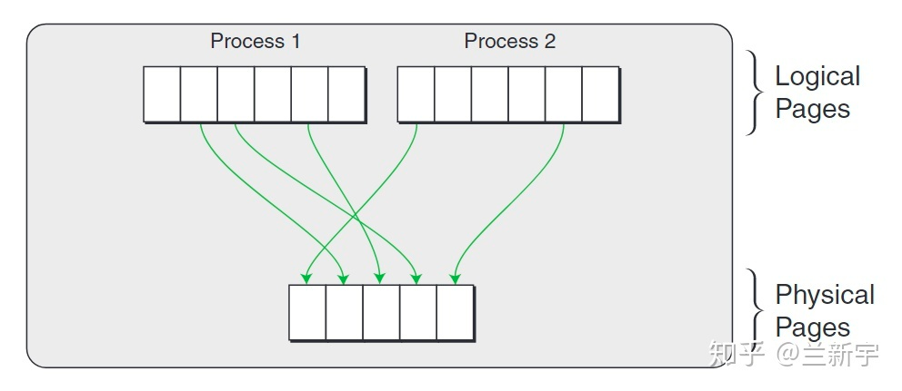
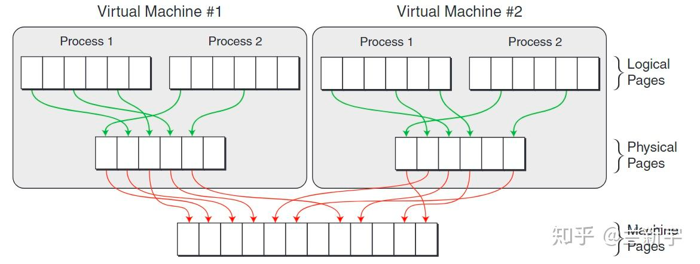
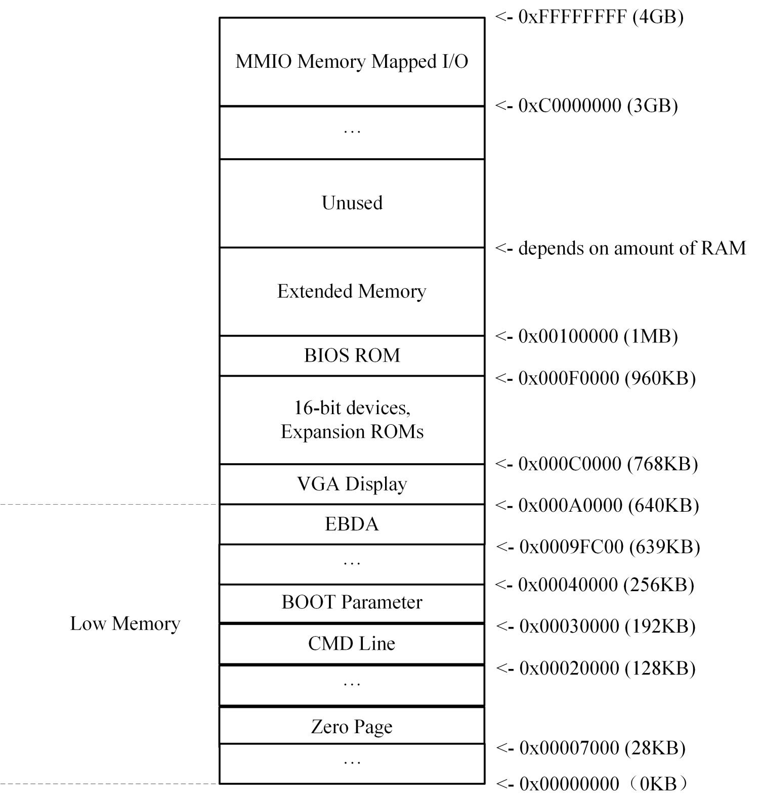

# 内存虚拟化

## 概述
内存虚拟化包含对虚拟机地址空间的管理和对 MMIO 资源的管理，通过 vm-memory 和 dbs-address-space crate 完成上述工作。除此之外，本文在最后介绍了加载内核到 Guest 内存的过程。

## 内存管理
在配置 KVM 后，开始初始化 guest memory。通过 `vm-memory`、`dbs-address-space` 完成。

1. vm-memory：在典型的虚拟机监视器 (VMM) 中，有几个组件需要访问 VM 物理内存，例如引导加载程序、虚拟设备驱动程序、virtio 后端驱动程序和虚拟主机驱动程序。 vm-memory crate 提供了一组特征来将 VM 内存消费者与 VM 内存提供者分离。基于这些特征，VM 内存消费者可以在不知道 VM 内存提供者的实现细节的情况下访问 VM 的物理内存。
1. dbs-address-space：虚拟机的地址空间管理器，它管理驻留在 Guest 物理地址空间中的内存和 MMIO 资源。

### 虚拟内存地址转换
内存虚拟化解决虚拟机里面的进程如何访问物理机上的内存的问题。MMU 中增加了一级页表（X86架构下叫EPT），MMU 通过该页表完成虚拟物理地址 (Guest Physical Address, GPA) 到主机物理地址 (Host Physical Address, HPA) 的转换。

- GuestOS 本身有虚拟地址空间，用 GVA 表示。
- 虚拟机认为自己独占整个内存空间，用 GPA 表示。
- HostOS 本身有虚拟机地址空间，用 HVA 表示。
- 宿主机本身有物理内存空间，用 HPA 表示。

当 CPU 处于 Guest 模式时，CPU 发出的内存访问请求，MMU 需要经过两层转换：首先是完成由虚拟地址到虚拟机物理地址的转换，接着是完成由虚拟机物理地址到真实物理地址的转换。内存虚拟化的问题变成了 GVA -> HPA 的映射问题。GVA -> GPA 通过 GuestOS 页表映射。HVA -> HPA 通过 HostOS 页表映射。因此，只要建立 GPA -> HVA 的映射关系，即可解决内存虚拟化的问题。可以保证不同虚拟机在内存访问上的隔离性。

在Linux这种使用虚拟地址的OS中，虚拟地址经过page table转换可得到物理地址。


> From [https://zhuanlan.zhihu.com/p/69828213](https://zhuanlan.zhihu.com/p/69828213)

如果这个操作系统是运行在虚拟机上的，那么这只是一个中间的物理地址（Intermediate Phyical Address - IPA），需要经过VMM/hypervisor的转换，才能得到最终的物理地址（Host Phyical Address - **HPA**）。从VMM的角度，guest VM中的虚拟地址就成了**GVA**(Guest Virtual Address)，IPA就成了**GPA**(Guest Phyical Address)。


> From [https://zhuanlan.zhihu.com/p/69828213](https://zhuanlan.zhihu.com/p/69828213)


可见，如果使用VMM，并且guest VM中的程序使用虚拟地址，那么就需要两次地址转换。


> From [https://zhuanlan.zhihu.com/p/69828213](https://zhuanlan.zhihu.com/p/69828213)

Guest 虚拟内存布局反映了将启动参数、MMIO 等参数写入到 Guest 内存的位置，具体可参考 [dbs-boot 中的定义](https://github.com/openanolis/dragonball-sandbox/blob/main/crates/dbs-boot/src/x86_64/layout.rs)，如下图所示：



### PIO 和 MMIO
MMIO (Memory mapping I/O) 即内存映射I/O，它是PCI规范的一部分，I/O设备被放置在内存空间而不是I/O空间。从处理器的角度看，内存映射I/O后系统设备访问起来和内存一样。这样访问AGP/PCI-E显卡上的帧缓存，BIOS，PCI设备就可以使用读写内存一样的汇编指令完成，简化了程序设计的难度和接口的复杂性。I/O作为CPU和外设交流的一个渠道，主要分为两种，一种是Port I/O，一种是MMIO (Memory mapping I/O)。简而言之，MMIO就是通过将外围设备映射到内存空间，便于CPU的访问。

#### PortIO和MMIO 的主要区别

1. 前者不占用CPU的物理地址空间，后者占有（这是对x86架构说的，一些架构，如IA64，port I/O占用物理地址空间）。
1. 前者是顺序访问。也就是说在一条I/O指令完成前，下一条指令不会执行。例如通过Port I/O对设备发起了操作，造成了设备寄存器状态变化，这个变化在下一条指令执行前生效。uncache的MMIO通过uncahce memory的特性保证顺序性。
1. 使用方式不同。

由于port I/O有独立的64K I/O地址空间，但CPU的地址线只有一套，所以必须区分地址属于物理地址空间还是I/O地址空间。

### 虚拟内存
使用 vm-memory 的 GuestMemoryMmap，可以配置 Guest 的内存空间。`create_guest_memory()` 需要输入从命令行获得的 `MemoryConfig`，包含提供给 Guest 的内存大小 `size_mib`。通过 `create_memory_regions()` 创建内存地址空间，在 x86_64 上，第15 ～ 23 行，如果配置的内存大小超过 MMIO 的起始地址，它们会围绕 MMIO 间隙进行创建（MMIO 设备插槽的专用空间）。

```rust
fn create_guest_memory(memory_config: &MemoryConfig) -> Result<GuestMemoryMmap> {
    let mem_size = ((memory_config.size_mib as u64) << 20) as usize;
    let mem_regions = Vmm::create_memory_regions(mem_size);

    // Create guest memory from regions.
    GuestMemoryMmap::from_ranges(&mem_regions)
    .map_err(|e| Error::Memory(MemoryError::VmMemory(e)))
}

fn create_memory_regions(mem_size: usize) -> Vec<(GuestAddress, usize)> {
    #[cfg(target_arch = "x86_64")]
    // On x86_64, they surround the MMIO gap (dedicated space for MMIO device slots) if the
    // configured memory size exceeds the latter's starting address.
    match mem_size.checked_sub(MMIO_GAP_START as usize) {
        // Guest memory fits before the MMIO gap.
        None | Some(0) => vec![(GuestAddress(0), mem_size)],
        // Guest memory extends beyond the MMIO gap.
        Some(remaining) => vec![
            (GuestAddress(0), MMIO_GAP_START as usize),
            (GuestAddress(MMIO_GAP_END), remaining),
        ],
    }
}
```

### 地址空间管理
为了更好的管理并使用虚拟机的地址空间，Dragonball-sandbox 提供了专门用于地址空间管理的 `dbs-address-space` crate。在 Miniball 中，我们仅用其创建最简单的示例，并在相应需要使用的地方通过 address_space 获得地址空间。更详细的使用内容可以参考 [Dragonball 中 address_space_manager 模块](https://github.com/kata-containers/kata-containers/blob/main/src/dragonball/src/address_space_manager.rs)的实现。

```rust
fn create_address_space(memory_config: &MemoryConfig) -> Result<AddressSpace> {
    let mem_size = ((memory_config.size_mib as u64) << 20) as usize;
    // create several memory regions
    let reg = Arc::new(
        AddressSpaceRegion::create_default_memory_region(
            GuestAddress(dbs_boot::layout::GUEST_MEM_START),
            mem_size as u64,
            None,
            "shmem",
            "",
            false,
            false,
        )
        .unwrap(),
    );
    let regions = vec![reg];

    // create layout (depending on archs)
    let layout = AddressSpaceLayout::new(
        *dbs_boot::layout::GUEST_PHYS_END,
        dbs_boot::layout::GUEST_MEM_START,
        *dbs_boot::layout::GUEST_MEM_END,
    );

    // create address space from regions and layout
    let address_space = AddressSpace::from_regions(regions, layout);

    Ok(address_space)
}
```

## 将 guest kernel 加载到 guest memory 中
将 guest kernel 加载到 guest memory 中。通过 `linux-loader` 和 `dbs-boot` crate 完成。

1. linux-loader：支持在 x86_64 上加载原始 ELF (vmlinux) 和压缩的 bzImage 格式内核映像。
1. dbs-boot：提供 boot 参数的结构体和 `add_e820_entry`。

### 步骤

1. 要求：配置 guest memory
2. 输入：
   1. 内核文件的路径
   2. high memory 起始地址 (x86_64)
   3. 内核命令行
   4. 启动参数，嵌入在 VMM 中
      1. 启动参数过于复杂，无法通过命令行或其他方式输入。这是依赖于 Miniball 的架构，使用 bindgen 构建并由 linux-loader 导出，用户在 linux-loader 外部填写特定于架构和用例的参数。
      2. 有些参数可以是常量并且可以在外部指定。比如：内核加载程序类型、内核引导标志、内核命令行的专用地址等。

### 原理介绍
X86 架构机器在上电之后，BIOS 系统首先进行基础的硬件初始化，将机器初始化到一个已知的状态，接着 BIOS 将 PC 指针跳转到特定位置以便引导内核的启动，最终将执行权从 BIOS 移交给内核。以上便是一个最简单的内核引导过程，在这个过程中， BIOS 会初始化并探测系统可用和预留的内存信息，并将其存储在指定位置，内核在初始话过程中，可以通过 BIOS 提供的一系列中断来获得内存相关的信息。

E820 内存管理器的由来与 BIOS 提供的中断有很深的联系。E820 内存管理器泛指从 BIOS 获得内存区域信息之后，对这些内存区域信息进行管理，以便于内存初始化时利用这些信息对可用物理内存和预留内存进行规划和初始化等操作。

内核在初始化过程中，从 E820 内存管理器中获得了基础的内存区域布局信息，可以从中看出每个区域的地址范围以及内存区域类型，内核根据这些信息，为之后的 Bootmem 内存管理器或者 MEMBLOCK 内存管理器的初始化提供了基础。

E820 内存管理器是用于管理内存区域的信息，但不包括内存的分配和回收功能，E820 内存管理器采用 struct e820_entry 描述一段内存区域信息，包括了内存区域的起始位置、长度以及内存区域类型，E820 内存管理器将多个内存区域维护在一张 E820 table 表里，该表使用 struct e820_table 进行描述。因此内核通过 E820 Table 表就可以知道当前机器的内存布局信息，有了这些信息之后，内核根据 E820 Table 提供的内存信息对 BootMEM 内存分配器或 MEMBLOCK 内核分配器进行初始化，因此在初始化接下来的内存分配器之前，内核可以提供一些手段来修改 E820 Table 表来控制未来系统的内存布局，这种修改比较常见的就是给系统 CMDLINE 机制提供选项，实现某段区域的预留，或者控制系统可用物理内存的长度等功能。

```c
struct e820_entry {
    uint64_t addr;	/* start of memory segment*/
    uint64_t size;	/* size of memory segment*/
    uint64_t type;	/* type of memory segment*/
} __attribute__((packed));
```

QEMU/KVM 作为虚拟化核心组件，其可以用于模拟 X86 运行环境，因此其具备构建 X86 平台硬件信息的能力，QEMU/KVM 同样提供了创建 E820 的机制，用于为 seaBIOS 模拟 E820 相关的硬件信息，其中包括了 BIOS 的 CMOS 内存，hw_cfg 固件信息等。

内核在初始化过程中，实时模式中从 BIOS 中获得并构建 E820 表，然后结合 CMDLINE 参数和 boot_params 参数构建内核自身的 E820 表，并基于该表构建系统的 IORESOURCE 信息和固件信息，最后基于 E820 表中可用内存区域信息构建 BootMEM 或者 MEMBLOCK 内存分配器

### 代码解读
在 Miniball 中，在启动虚拟机前进行加载内核、加载命令行和配置启动参数的操作。以上过程，通过 `load_kernel()` 完成，并返回 `load_result`，以供计算获得内核加载的地址，用于启动虚拟机。

```rust
pub fn run(&mut self) -> Result<()> {
    let load_result = self.load_kernel()?;
    #[cfg(target_arch = "x86_64")]
    let kernel_load_addr = self.compute_kernel_load_addr(&load_result)?;

    ...

    self.vm.run(Some(kernel_load_addr)).map_err(Error::Vm)?;
    loop {
        match self.event_mgr.run() {
            Ok(_) => (),
            Err(e) => eprintln!("Failed to handle events: {:?}", e),
        }
        if !self.exit_handler.keep_running() {
            break;
        }
    }
    self.vm.shutdown();

    Ok(())
    }
```

加载内核的过程如下：

1. 加载内核镜像到 guest 内存中
1. 加载内核命令行到 guest 内存中
1. 配置启动参数

#### 加载内核镜像
第 4 行，加载了 kernel 的镜像。第 6 ～ 24 行，通过 ELF 将 kernel 的镜像加载到 Guest 内存中。

```rust
// Load the kernel into guest memory.
#[cfg(target_arch = "x86_64")]
fn load_kernel(&mut self) -> Result<KernelLoaderResult> {
    let mut kernel_image = File::open(&self.kernel_cfg.path).map_err(Error::IO)?;

    // Load the kernel into guest memory.
    let kernel_load = match Elf::load(
        &self.guest_memory,
        None,
        &mut kernel_image,
        Some(GuestAddress(self.kernel_cfg.load_addr)),
    ) {
        Ok(result) => result,
        Err(loader::Error::Elf(elf::Error::InvalidElfMagicNumber)) => BzImage::load(
            &self.guest_memory,
            None,
            &mut kernel_image,
            Some(GuestAddress(self.kernel_cfg.load_addr)),
        )
        .map_err(Error::KernelLoad)?,
        Err(e) => {
            return Err(Error::KernelLoad(e));
        }
    };

    ...
    
    Ok(kernel_load)
}
```

#### 加载内核命令行
第 6 ～ 13 行，加载内核命令行到 Guest 内存中，传入 Guest memory 和命令行起始地址，并保留命令行地址待之后输入到启动参数中。

```rust
// Load the kernel into guest memory.
#[cfg(target_arch = "x86_64")]
fn load_kernel(&mut self) -> Result<KernelLoaderResult> {
    ...

    // Load the kernel command line into guest memory.
    let cmdline_addr = dbs_boot::layout::CMDLINE_START;
    linux_loader::loader::load_cmdline(
        &self.guest_memory,
        GuestAddress(cmdline_addr),
        &self.kernel_cfg.cmdline,
    )
    .map_err(Error::LoadCommandline)?;
    
    ...
}
```

#### 配置启动参数
第 6 ～ 16 行，配置启动参数，参数的详细内容在之后代码中介绍。
```rust
// Load the kernel into guest memory.
#[cfg(target_arch = "x86_64")]
fn load_kernel(&mut self) -> Result<KernelLoaderResult> {
    ...
    
    // Generate boot parameters.
    build_bootparams(
        &self.guest_memory,
        &self.address_space,
        GuestAddress(self.kernel_cfg.load_addr),
        GuestAddress(MMIO_GAP_START),
        GuestAddress(MMIO_GAP_END),
        GuestAddress(cmdline_addr),
        (self.kernel_cfg.cmdline.as_str().len() + 1) as usize,
    )
    .map_err(Error::BootParam)?;

    ...
}
```

##### zero page
对于具有传统 BIOS 以外的一些新 BIOS 的计算机，例如 EFI、LinuxBIOS 等和 kexec，无法使用基于传统 BIOS 的内核中的 16 位实模式设置代码，因此需要定义 32 位引导协议。

在32位引导协议中，加载 Linux 内核的第一步应该是设置引导参数（结构 boot_params，传统上称为 `zero page`）。结构boot_params的内存应分配并初始化为全部为零。在 64 位引导协议中，结构boot_params的内存可以分配到任何地方（甚至高于4G），同样初始化为全部为零。然后，应将内核映像的偏移0x01f1的 setup 标头加载到结构boot_params并检查。

除了读/修改/写入结构的安装标头boot_params 16 位引导协议的安装头之外，引导加载程序还应填充结构boot_params的其他字段，如 [Documentation/x86/zero-page.rst](https://www.kernel.org/doc/html/v5.8/x86/zero-page.html) 一章中所述。

设置结构boot_params后，引导加载程序可以采用与 16 位引导协议相同的方式加载 32/64 位内核。

在 32 位引导协议中，内核通过跳转到 32 位内核入口点（即加载的 32/64 位内核的起始地址）来启动。
在进入时，CPU 必须处于 32 位保护模式，并禁用分页;GDT必须加载选择器__BOOT_CS（0x10）和__BOOT_DS（0x18）的描述符;两个描述符都必须是4G平面段;__BOOT_CS必须具有执行/读取权限，__BOOT_DS必须具有读/写权限;CS必须__BOOT_CS DS，ES，SS必须__BOOT_DS;必须禁用中断;%esi 必须保存结构的基址boot_params;%ebp、%edi 和 %ebx 必须为零。

在 64 位引导协议中，内核通过跳转到 64 位内核入口点（即加载的 64 位内核加0x200的起始地址）来启动。
在进入时，CPU 必须处于启用了分页的 64 位模式。从加载的内核的起始地址到零页和命令行缓冲区，具有setup_header.init_size的范围得到ident映射;GDT必须加载选择器__BOOT_CS（0x10）和__BOOT_DS（0x18）的描述符;两个描述符都必须是4G平面段;__BOOT_CS必须具有执行/读取权限，__BOOT_DS必须具有读/写权限;CS必须__BOOT_CS DS，ES，SS必须__BOOT_DS;必须禁用中断;%rsi 必须保存结构boot_params的基址。

##### 代码解读

第 9 ～ 11 行，先判断输入的MMIO 起始地址是否小于终止地址。

第 13 ～ 22 行，构造启动参数：

- type_of_loader：除非使用预先注册的引导加载程序，否则该字段必须设置为 0xff。
- boot_flag：magic number `0xAA55`。
- header：magic number `0x53726448`。
- kernel_alignment：内核所需的对齐单元。
- cmd_line_ptr：命令行的起始地址。
- cmdline_size：命令行所占地址空间的大小。

更多有关启动参数的完整信息，请[参阅](https://www.kernel.org/doc/html/v5.8/x86/boot.html)。

第 24 ～ 26 行，通过 `add_e820_entry()` 方法将启动参数信息加载到数据区 EBDA 中。第 28 ～ 69 行，根据 Guest 内存的大小与 MMIO 地址范围的关系将启动参数写入对应的位置。第 72 ～ 79 行，将启动参数写入 zero page 中。

```rust
pub fn build_bootparams(
    guest_memory: &GuestMemoryMmap,
    address_space: &AddressSpace,
    himem_start: GuestAddress,
    mmio_gap_start: GuestAddress,
    mmio_gap_end: GuestAddress,
    cmdline_addr: GuestAddress,
    cmdline_size: usize,
) -> result::Result<(), Error> {
    if mmio_gap_start >= mmio_gap_end {
        return Err(Error::MmioGapStartPastMmioGapEnd);
    }

    let mut boot_params: BootParamsWrapper = BootParamsWrapper(boot_params::default());

    boot_params.0.hdr.type_of_loader = KERNEL_LOADER_OTHER;
    boot_params.0.hdr.boot_flag = KERNEL_BOOT_FLAG_MAGIC;
    boot_params.0.hdr.header = KERNEL_HDR_MAGIC;
    boot_params.0.hdr.kernel_alignment = KERNEL_MIN_ALIGNMENT_BYTES;

    // Add the kernel command line to the boot parameters.
    boot_params.0.hdr.cmd_line_ptr = cmdline_addr.raw_value() as u32;
    boot_params.0.hdr.cmdline_size = cmdline_size as u32;

    // Add an entry for EBDA itself.
    add_e820_entry(&mut boot_params.0, 0, layout::EBDA_START, E820_RAM)
        .map_err(Error::BootSystem)?;

    // Add entries for the usable RAM regions (potentially surrounding the MMIO gap).
    let last_addr = address_space.last_addr();
    if last_addr < mmio_gap_start {
        add_e820_entry(
            &mut boot_params.0,
            himem_start.raw_value(),
            // The unchecked + 1 is safe because:
            // * overflow could only occur if last_addr - himem_start == u64::MAX
            // * last_addr is smaller than mmio_gap_start, a valid u64 value
            // * last_addr - himem_start is also smaller than mmio_gap_start
            last_addr
                .checked_offset_from(himem_start)
                .ok_or(Error::HimemStartPastMemEnd)? as u64
                + 1,
            E820_RAM,
        )
        .map_err(Error::BootSystem)?;
    } else {
        add_e820_entry(
            &mut boot_params.0,
            himem_start.raw_value(),
            mmio_gap_start
                .checked_offset_from(himem_start)
                .ok_or(Error::HimemStartPastMmioGapStart)?,
            E820_RAM,
        )
        .map_err(Error::BootSystem)?;

        if last_addr > mmio_gap_end {
            add_e820_entry(
                &mut boot_params.0,
                mmio_gap_end.raw_value() + 1,
                // The unchecked_offset_from is safe, guaranteed by the `if` condition above.
                // The unchecked + 1 is safe because:
                // * overflow could only occur if last_addr == u64::MAX and mmio_gap_end == 0
                // * mmio_gap_end > mmio_gap_start, which is a valid u64 => mmio_gap_end > 0
                last_addr.unchecked_offset_from(mmio_gap_end) as u64 + 1,
                E820_RAM,
            )
            .map_err(Error::BootSystem)?;
        }
    }

    // Write the boot parameters in the zeropage.
    let zero_page_addr = GuestAddress(layout::ZERO_PAGE_START);
    guest_memory
        .checked_offset(zero_page_addr, mem::size_of::<boot_params>())
        .ok_or(Error::ZeroPagePastRamEnd)?;
    guest_memory
        .write_obj(boot_params, zero_page_addr)
        .map_err(|_| Error::ZeroPageSetup)?;

    Ok(())
}
```

```rust
fn add_e820_entry(
    params: &mut boot_params,
    addr: u64,
    size: u64,
    mem_type: u32,
) -> result::Result<(), Error> {
    if params.e820_entries >= params.e820_table.len() as u8 {
        return Err(Error::E820Configuration);
    }

    params.e820_table[params.e820_entries as usize].addr = addr;
    params.e820_table[params.e820_entries as usize].size = size;
    params.e820_table[params.e820_entries as usize].type_ = mem_type;
    params.e820_entries += 1;

    Ok(())
}
```


